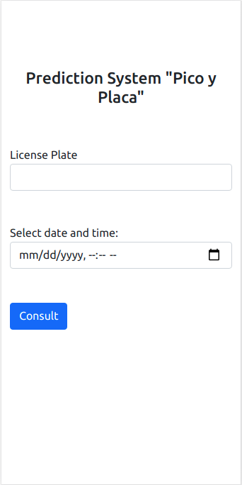
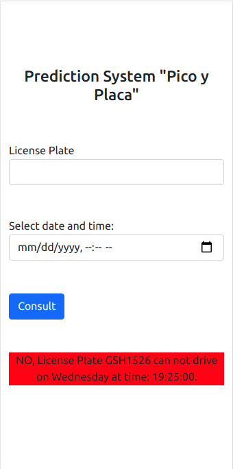
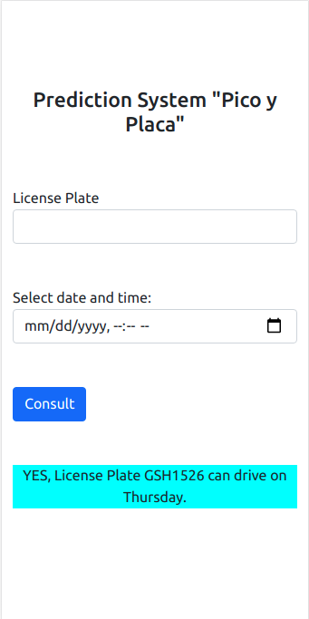

# Pico y Placa, License Plate number predictor for traffic in peak hours

### Description:
Using the language that you feel most proficient in, we’d like you to write a "Pico y Placa" predictor. The inputs should be a license plate number (the full number, not the last digit), a date (as a String), and a time, and the program will return whether or not that car can be on the road. You may use any input and output method you prefer. 

### Peak hour rules:

Within a specified city, you can not drive (car or motorcicle) during the peak hours (07:00 - 09:30 and 16:00 - 19:30) if your
vehicule's last digit is blacklisted for the day.

| Day               | Black Digits |
|-------------------|--------------|
| Monday            | 1 - 2        |
| Tuesday           | 3 - 4        |
| Wednesday         | 5 - 6        |
| Thursday          | 7 - 8        |
| Friday            | 9 - 0        |
| Saturday & Sunday | None         |

### Solution Description:

This project have been develop with Python3.8 using a web framework to use as input method.

##### How to run:

- Download the project and enter.
~~~
git clone https://github.com/fnando1995/SBProj.git
cd SBProj
~~~

- Create a virtual environment and install dependencies. (Python3 must be installed in you Computer).
~~~
python3 -m venv env
source env/bin/activate
pip install -r requirements           #dependencies
~~~

- Run development server
~~~
python manage.py runserver
~~~

- Check the link: 127.0.0.1/picoyplaca/

You can enter the license plate number (7 alphanumeric characters), and the date and time in the datepicker. Finally you can submit with the "Consult" buttom.

After consulting, the application will erase the information for a new consult, leaving the result of the last consult as a message with a colored background.

###### Note: Images are in web mobile.

  

### Production:

For production deployment contact developer: @fnando1995 ;)